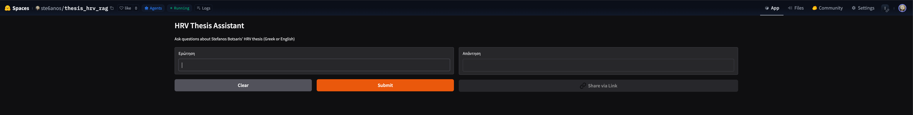

# HRV Thesis RAG Assistant

A Retrieval-Augmented Generation (RAG) system built over a Greek medical thesis on Heart Rate Variability (HRV) analysis in Psoriatic Arthritis patients. Ask questions in Greek or English and get answers grounded in the thesis content.

## Demo

Try it live:** [huggingface.co/spaces/ste6anos/thesis_hrv_rag](https://huggingface.co/spaces/ste6anos/thesis_hrv_rag)

> Note: The app may take 1-2 minutes to wake up if it has been inactive.
> 


Built as a portfolio project for ML engineering roles. Demonstrates end-to-end RAG pipeline with multilingual support.

## Features

- **Multilingual support** — ask in Greek or English, get answers in both languages
- **Cross-lingual retrieval** — questions are translated to Greek before retrieval, ensuring accurate semantic search over the Greek source document
- **Semantic search** — uses FAISS vector store with `intfloat/multilingual-e5-large` embeddings
- **Gradio UI** — clean web interface accessible via browser

## Architecture

```
PDF → Text Extraction (PyMuPDF)
    → Chunking (sliding window, 400 words, overlap 50)
    → Embeddings (multilingual-e5-large)
    → FAISS Index                          [ingest.py]

Question (EN/EL)
    → Translate to Greek (Qwen 72B)
    → Embed query (multilingual-e5-large)
    → FAISS Search (Top-K chunks)
    → LLM Answer in Greek (Qwen 72B)
    → Translate answer to English (Qwen 72B)
    → Return bilingual response            [rag.py]

Gradio UI                                  [app.py]
```

## Stack

| Component | Tool |
|---|---|
| PDF extraction | PyMuPDF |
| Embeddings | `intfloat/multilingual-e5-large` |
| Vector store | FAISS (faiss-cpu) |
| LLM | Qwen/Qwen2.5-72B-Instruct (HuggingFace Inference API) |
| UI | Gradio |

## Project Structure

```
thesis_hrv_rag/
├── .env                  # HF_TOKEN (not committed)
├── .gitignore
├── requirements.txt
├── data/
│   ├── thesis_report.pdf
│   ├── faiss_index.bin   # generated by ingest.py
│   └── chunks.json       # generated by ingest.py
└── src/
    ├── ingest.py         # PDF → FAISS index
    ├── rag.py            # RAG pipeline + answer_question()
    └── app.py            # Gradio UI
```

## Setup

### 1. Clone and create virtual environment

```bash
git clone https://github.com/your-username/thesis-hrv-rag
cd thesis_hrv_rag
python3 -m venv hrv-rag-env
source hrv-rag-env/bin/activate
pip install -r requirements.txt
```

### 2. Add your HuggingFace token

Create a `.env` file in the root:

```
HF_TOKEN=hf_your_token_here
```

Get a token at [huggingface.co/settings/tokens](https://huggingface.co/settings/tokens) with **Inference Providers** permissions enabled.

### 3. Add your PDF

Place your thesis PDF at `data/thesis_report.pdf`.

### 4. Build the FAISS index

```bash
python src/ingest.py
```

### 5. Launch the app

```bash
python src/app.py
```

Open [http://127.0.0.1:7860](http://127.0.0.1:7860) in your browser.

## Known Limitations

- **Table extraction** — PyMuPDF does not preserve table structure from PDFs. Numerical results inside tables may not be retrieved accurately. Future improvement: parse the LaTeX source directly.
- **Image pages** — pages containing only figures or diagrams yield no extractable text.
- **Retrieval quality** — results depend on semantic similarity between the query and chunk embeddings. Highly specific numerical queries (e.g. exact p-values) may not always retrieve the correct chunk.

## About the Thesis

The underlying document is a Stefanos Botsaris' diploma thesis, student in Electrical and Computer engineering from Aristotle University of Thessaloniki (AUTH), analyzing HRV signals from 111 Psoriatic Arthritis patients across the EU. It explores whether HRV metrics from smartwatch data can distinguish inflammatory flares using Machine Learning.

**Key finding:** At low HR activity, inflammatory flares show statistically significant separation in ULF, VLF, and LF frequency bands (DOC_FLARE: p=0.004, p=0.022, p=0.019).
